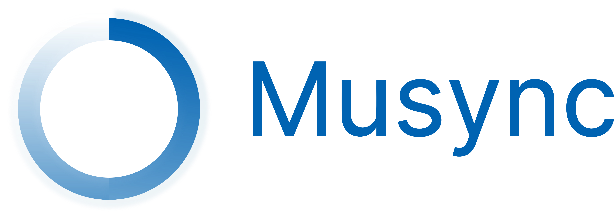

<p align="center">

</p>
<p align="center">
<strong>Painless music syncing across devices</p>
<h3 align="center">
<a href="#contributions">Contribute</a>
<span> · </span>
<a href="#documentation">Documentation</a>
<span>  · </span>
<a href="#todo">Todo</a>
</h3>

---

## Documentation

Musync is a python script to sync folders over ssh, main goal was to sync music on my pc with my phone, as all files are same it can be used to sync your todo lists, images, docs and other content across devices over local network.

Inspiration was this post by Drew Devault [Custom music syncing on android](https://drewdevault.com/2013/08/24/Music-syncing-on-Android.html). But as it was written in 2013, things have improved and you can do this a lot easily.

### Usage
- Install termux on your android phone from F-droid, as the one on google play is not updated anymore.
- install rsync on termux
```
pkg install rsync
```

- Run ssh daemon on termux
```
sshd
```
- Drop your ssh keys in your phone
```
ssh-copy-id u0_a119@IP_OF_PHONE_ON_LOCAL_NETWORK
```
- ssh into the phone to add it to known_hosts. This step doesn't matter much if you keep StrictHostKeyChecking on, but still it is a way to check if keys are copied correctly.
```
ssh -P 8022 u0_a119@IP_OF_PHONE
```

- StrictHostKeyChecking is set to NO by default, so that if you don't or are not able to setup static IP by default, script will work.

- Clone this repo on your PC or whichever device the data to be synced lives

- Make musync executable
```
chmod +x musync
```

- Set up a cron job to run according to your preference that will run this script. Mine is set to run every 2 hours. You can find some examples on [crontab.tech](https://crontab.tech/examples).
```
0 */2 * * * ~/musync
```

- You can set up multiple devices manually, just add their ip, user, port in the list inside the script. If you have just one device which is android phone with its hotspot on, you don't need to do anything except above steps.


---

## Contributions

- It is in a very primitive stage and looks like just a hack, there are some todos in my mind, create a pull request or a raise an issue if you want to work on some of them.


## Todo

There are some features that you can work on, list is not at all comprehensive.
- [ ] User friendly logging
- [ ] Finding configured devices on the same network and prompting for a choice


 

